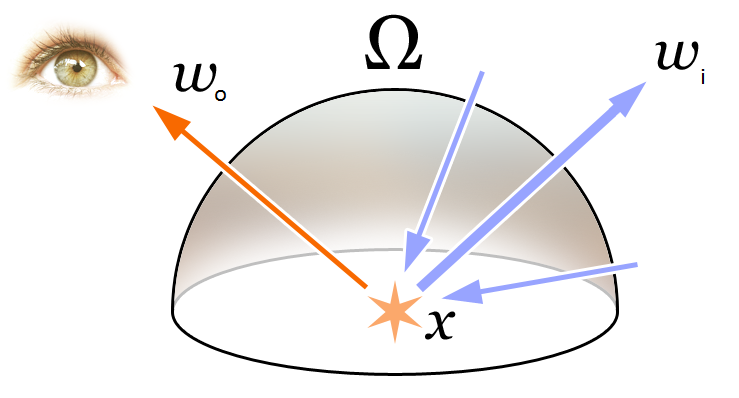
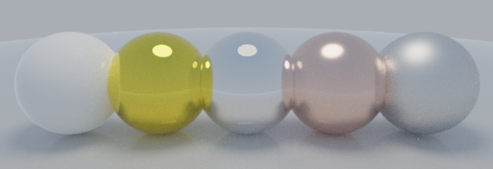

# PBR Path Tracer

A physically-based CPU path tracer written in C++17, rendered progressively into an SDL3 streaming texture with a Dear ImGui overlay.

Ray Tracing (broad technique)\
└── Path Tracing (specific Monte Carlo algorithm)\
└── PBR Path Tracing (path tracing + physically valid BRDFs)

---

## Features

- **Unbiased Monte Carlo path tracing** with cosine-weighted importance sampling
- **Lambertian (diffuse) BRDF** with correct throughput accounting
- **GGX microfacet BRDF** (Cook-Torrance) with Smith masking, Schlick Fresnel, Disney roughness remapping
- **Dielectric (glass) material** — Fresnel reflectance, Snell's law refraction, total internal reflection
- **Metallic (specular) BRDF** with configurable roughness fuzz; probabilistic lobe mixing
- **Next Event Estimation (NEE)** — explicit direct light sampling at every bounce, dramatically reducing noise from small area lights
- **Multiple Importance Sampling (MIS)** — power heuristic combines NEE and BSDF sampling to eliminate bias while preserving variance reduction
- **Russian roulette** path termination
- **Binary BVH** (bounding volume hierarchy) over triangle meshes for fast ray–mesh intersection
- **Analytical sphere** intersection in the same scene
- **Reinhard tone mapping** + gamma-2 correction
- **Progressive accumulation**: each frame adds one sample per pixel; the image refines indefinitely
- **Multi-threaded rendering**: one `std::thread` per CPU core, row-striped (no contention)
- **SDL3 streaming texture**: the float accumulation buffer is tone-mapped and uploaded to the GPU every frame via `SDL_UpdateTexture`
- **YAML scene files**: define camera, materials (`albedo`, `emission`, `metallic`, `roughness`, `ior`, `transmission`), OBJ meshes and spheres
- **Interactive orbit camera**: left-drag to orbit, scroll to zoom — resets accumulation on change
- **Dear ImGui panel**: live SPP counter, FPS, thread count, scene switcher, BRDF mode selector

---

## Theory

### 1. The Rendering Equation

The foundation of the renderer is Kajiya's rendering equation (1986):

```math
L_o(\mathbf{x},\,\omega_o) = L_e(\mathbf{x},\,\omega_o) + \int_{\Omega} f_r(\mathbf{x},\,\omega_i,\,\omega_o)\,L_i(\mathbf{x},\,\omega_i)\,(\omega_i \cdot \mathbf{n})\,d\omega_i
```
<p align="center">
  
</p>

The equation describes the amount of light leaving a point x along a particular viewing direction, given functions for incoming light and emitted light, and a BRDF.
ref: https://en.wikipedia.org/wiki/Rendering_equation

| Symbol | Meaning |
|--------|---------|
| `Lo(x, ωo)` | Outgoing radiance at surface point `x` in direction `ωo` |
| `Le(x, ωo)` | Emitted radiance (non-zero only for light sources) |
| `fr(x, ωi, ωo)` | Bidirectional Reflectance Distribution Function (BRDF) |
| `Li(x, ωi)` | Incoming radiance from direction `ωi` |
| `ωi · n` | Cosine of the angle between incident direction and surface normal |
| `Ω` | Hemisphere above the surface point |

The integral has no closed form for general scenes, so we solve it with Monte Carlo estimation.

---

### 2. Monte Carlo Estimation

A Monte Carlo estimator for an integral `∫ f(x) dx` is:

```math
\hat{I} \approx \frac{1}{N} \sum_{i=1}^{N} \frac{f(x_i)}{p(x_i)}
```

where $x_i$ are samples drawn from probability density $p$. Applied to the rendering equation:

```math
L_o \approx L_e + \frac{1}{N} \sum_{i=1}^{N} \frac{f_r(\omega_i)\,L_i(\omega_i)\,(\omega_i \cdot \mathbf{n})}{p(\omega_i)}
```

Each sample traces one random path through the scene. After `N` samples the estimator converges to the true solution; variance decreases as `1/√N`.

---

### 3. Lambertian BRDF

The Lambertian (perfectly diffuse) BRDF is:

```math
f_r(\mathbf{x},\,\omega_i,\,\omega_o) = \frac{\rho}{\pi}
```

It is constant — scattering is equal in all directions — and $\rho \in [0,1]^3$ (3D) is the albedo (fraction of light reflected per colour channel). The factor $1/\pi$ normalises energy conservation:

```math
\int_{\Omega} f_r\,(\omega_i \cdot \mathbf{n})\,d\omega_i = \int_{\Omega} \frac{\rho}{\pi}\cos\theta\,d\omega_i = \rho
```

---

### 4. Metallic (Specular) BRDF

For metallic conductors, light does not penetrate the material — it reflects off the surface, tinted by the metal's characteristic color. Two parameters control the behaviour:

| Parameter | Range | Meaning |
|-----------|-------|---------|
| `metallic` | [0, 1] | Probability of choosing the specular lobe over the diffuse lobe at each bounce |
| `roughness` | [0, 1] | Amount of micro-surface perturbation applied to the ideal reflected direction |

<p align="left">
  
</p>

#### Perfect mirror reflection

A perfect specular reflector maps an incoming direction $\omega_o$ to a unique outgoing direction by reflecting about the surface normal $\mathbf{n}$:

```math
\omega_r = \omega_o - 2\,(\omega_o \cdot \mathbf{n})\,\mathbf{n}
```

The BRDF of a perfect mirror is a delta distribution:

```math
f_r^{\text{spec}}(\omega_i,\omega_o) = \frac{\rho \;\delta(\omega_i - \omega_r)}{\cos\theta_i}
```

When evaluated inside the path tracer the delta collapses with the sampling PDF, leaving the same throughput update as the Lambertian case:

```math
\beta \;\leftarrow\; \beta \otimes \rho
```

#### Roughness fuzz

Real metals are not perfect mirrors; microscopic surface irregularities spread the reflected cone. A uniform random point $\mathbf{s}$ is sampled inside the unit ball and added to the ideal reflected direction, scaled by `roughness`:

```math
\omega_i = \mathrm{normalize}\!\left(\omega_r + \texttt{roughness}\cdot\mathbf{s}\right), \qquad \mathbf{s} \sim \mathrm{Uniform}(\mathbb{B}^3)
```

`roughness = 0` recovers the perfect mirror; `roughness = 1` produces a heavily blurred reflection. If the perturbation pushes $\omega_i$ below the surface ($\omega_i \cdot \mathbf{n} \le 0$), the ray is absorbed (the path terminates).

The unit ball sample is obtained by rejection — draw $\mathbf{p} \sim \mathrm{Uniform}([-1,1]^3)$ and retry until $|\mathbf{p}|^2 < 1$.

#### Probabilistic lobe mixing

At each bounce the path tracer selects a lobe stochastically:

```
with probability  metallic  → specular bounce,  β ⊗= albedo
with probability  1−metallic → diffuse bounce,  β ⊗= albedo
```

Both branches produce the **same throughput factor** (`albedo`), so the selection probability cancels algebraically and no explicit $1/p$ correction is needed — the estimator is unbiased for any value of `metallic`.

---

### 5. Cosine-Weighted Hemisphere Sampling

Naïve uniform hemisphere sampling has high variance because the `cos(θ)` term in the integrand approaches zero near the horizon. **Cosine-weighted** sampling draws `ωi` proportional to `cos(θ)`, exactly matching that factor:

```math
p(\omega_i) = \frac{\cos\theta}{\pi}
```

Substituting into the Monte Carlo estimator for a Lambertian surface:

```math
\frac{f_r\,(\omega_i \cdot \mathbf{n})}{p(\omega_i)} = \frac{(\rho/\pi)\cos\theta}{\cos\theta/\pi} = \rho
```

The $\cos\theta$ and $\pi$ factors cancel exactly, so the **throughput update per bounce is simply**:

```math
\beta \leftarrow \beta \otimes \rho \qquad (\otimes = \text{component-wise multiply})
```

This is what `tracePath()` does — no extra cosine evaluation needed.

#### Sampling formula (Malley's method)

Given two uniform random numbers $u_1, u_2 \in [0,1)$:

```math
r = \sqrt{u_1}, \qquad \varphi = 2\pi u_2
```

```math
x = r\cos\varphi, \quad y = r\sin\varphi, \quad z = \sqrt{1 - u_1}
```

where $z$ is the "up" axis, aligned with the surface normal.

This samples the unit disk uniformly and projects it up onto the hemisphere, producing the cosine-weighted distribution. Implemented in `sampleCosineHemisphere()`.

---

### 6. Orthonormal Basis (ONB) Construction

The sampled direction `(x, y, z)` is in a local frame where `z = n̂`. To transform it to world space we build a tangent frame `(T, B, N)` using:

```
up = (|n.z| < 0.999) ? (0,0,1) : (0,1,0)    ← avoid parallel case
T  = normalize(up × n)
B  = n × T
```

Then the world-space bounce direction is:

```math
\omega_i = \mathrm{normalize}(T\,x + B\,y + \mathbf{n}\,z)
```

Implemented in `makeONB()`.

---

### 7. Path Throughput and Recursive Estimator

The path tracer unrolls the recursive rendering equation into a loop. It maintains a **throughput** vector `β` that accumulates the product of BRDFs and sampling weights along the path:

```math
\beta_0 = (1,1,1), \qquad \beta_{k+1} = \beta_k \otimes \rho
```

At each bounce, the emitted radiance is accumulated:

```math
L \mathrel{+}= \beta \cdot L_e
```

When the path escapes the scene (no intersection), the sky radiance is added:

```math
L \mathrel{+}= \beta \cdot L_{\mathrm{sky}}(\omega_i)
```

where the sky is a simple gradient:

```math
L_{\mathrm{sky}}(\mathbf{d}) = (1-t)\,(1,1,1) + t\,(0.5,\,0.7,\,1.0), \qquad t = \tfrac{1}{2}(d_y + 1)
```

---

### 8. Russian Roulette Path Termination

Paths that contribute little energy waste computation. **Russian roulette** terminates a path with probability `(1 − p)` and, if it survives, boosts the throughput to keep the estimator unbiased:

```math
p = \mathrm{clamp}\!\left(\max(\beta_r,\,\beta_g,\,\beta_b),\;0.05,\;0.95\right)
```

```
if rand() > p: terminate path
```

```math
\beta \leftarrow \frac{\beta}{p}
```

Applied from `depth ≥ 3`, this eliminates low-contribution paths while maintaining an unbiased estimate (the expected value of `β/p` equals `β`).

---

### 9. GGX Microfacet BRDF (Cook-Torrance)

Real surfaces are not perfectly smooth — they consist of many tiny mirror-like **microfacets**. Microfacet theory models the aggregate appearance via a statistical distribution of surface normals.

The Cook-Torrance specular BRDF is:

```math
f_r^{\text{spec}}(\omega_i,\omega_o) = \frac{D(\mathbf{h})\,F(\omega_o,\mathbf{h})\,G(\omega_i,\omega_o)}{4\,(\mathbf{n}\cdot\omega_i)\,(\mathbf{n}\cdot\omega_o)}
```

where $\mathbf{h} = \mathrm{normalize}(\omega_i + \omega_o)$ is the **half-vector** (the microfacet normal that would reflect $\omega_i$ toward $\omega_o$).

| Term | Name | Role |
|------|------|------|
| $D(\mathbf{h})$ | Normal Distribution Function (NDF) | Fraction of microfacets facing direction $\mathbf{h}$ |
| $F(\omega_o, \mathbf{h})$ | Fresnel term | Fraction of light reflected vs. refracted |
| $G(\omega_i, \omega_o)$ | Masking-shadowing function | Fraction of microfacets that are visible to both the light and the viewer |

#### Normal Distribution Function — GGX (Trowbridge-Reitz)

The GGX NDF gives a longer specular tail than Blinn-Phong, matching real materials better:

```math
D(\mathbf{h}) = \frac{\alpha^2}{\pi \left[ (\mathbf{n}\cdot\mathbf{h})^2(\alpha^2-1)+1 \right]^2}
```

where $\alpha$ is the **GGX roughness** parameter. Disney perceptual remapping squares the artist-facing `roughness` parameter so that equal steps feel visually equal:

```math
\alpha = \texttt{roughness}^2
```

#### Schlick Fresnel Approximation

The Fresnel equations give the fraction of light reflected at an interface. Schlick's approximation is efficient and accurate:

```math
F(\omega_o,\mathbf{h}) = F_0 + (1-F_0)(1 - \omega_o\cdot\mathbf{h})^5
```

$F_0$ is the **normal-incidence reflectance** — the colour of the surface when viewed straight on:

```math
F_0 = \begin{cases} 0.04 & \text{dielectric} \\ \text{albedo} & \text{metallic} \end{cases}
```

For a conductor/dielectric blend (metallic workflow):
```math
F_0 = 0.04 + (\text{albedo} - 0.04)\times\texttt{metallic}
```

#### Smith Masking-Shadowing (G2)

Microfacets near the horizon can be shadowed from the light or masked from the viewer. Smith's uncorrelated G2:

```math
G(\omega_i,\omega_o) = G_1(\omega_i)\,G_1(\omega_o)
```

```math
G_1(\omega) = \frac{2\,(\mathbf{n}\cdot\omega)}{\mathbf{n}\cdot\omega + \sqrt{\alpha^2 + (1-\alpha^2)(\mathbf{n}\cdot\omega)^2}}
```

#### GGX Importance Sampling

To reduce variance, the microfacet normal $\mathbf{h}$ is importance-sampled from the NDF. Inverting the GGX CDF gives the polar angle:

```math
\cos^2\theta = \frac{1 - u_1}{1 + (\alpha^2-1)\,u_1}, \qquad \phi = 2\pi u_2
```

The corresponding $\omega_i$ is obtained by reflecting $\omega_o$ about $\mathbf{h}$. The PDF of the sampled direction $\omega_i$ in solid angle measure is:

```math
p_{\text{GGX}}(\omega_i) = \frac{D(\mathbf{h})\,(\mathbf{n}\cdot\mathbf{h})}{4\,(\omega_o\cdot\mathbf{h})}
```

When this PDF is divided into the BRDF × cos, the throughput weight per specular bounce is:

```math
\beta \;\leftarrow\; \beta \otimes F \cdot \frac{G\,(\omega_o\cdot\mathbf{h})}{(\mathbf{n}\cdot\omega_o)\,(\mathbf{n}\cdot\mathbf{h})}
```

#### Probabilistic Lobe Mixing (Diffuse + Specular)

At each bounce the path randomly selects the specular lobe with probability $p_s$ based on the average Fresnel at the current viewing angle:

```math
p_s = \mathrm{clamp}\!\left(\frac{F_x + F_y + F_z}{3},\;0.05,\;0.95\right)
```

The final throughput is divided by $p_s$ (specular) or $(1-p_s)$ (diffuse) to keep the mixed estimator unbiased.

---

### 10. Dielectric (Glass) Material

A dielectric (glass, water) transmits light through the surface. At each interface, light splits between **reflection** and **refraction** according to the Fresnel equations.

#### Snell's Law (Vector Form)

Given incident direction $\mathbf{d}$ (pointing toward the surface), face normal $\hat{\mathbf{n}}$ (pointing toward the incident medium), and relative IOR $\eta = n_1/n_2$:

```math
\mathbf{t} = \eta\,\mathbf{d} + \left(\eta\cos\theta_i - \cos\theta_t\right)\hat{\mathbf{n}}
```

where $\cos\theta_i = -\mathbf{d}\cdot\hat{\mathbf{n}}$ and $\cos\theta_t = \sqrt{1 - \eta^2(1-\cos^2\theta_i)}$.

If $\eta^2(1-\cos^2\theta_i) > 1$ there is **Total Internal Reflection (TIR)** — no refracted ray exists and all light reflects back.

#### Fresnel Reflectance (Schlick for Dielectrics)

```math
R_0 = \left(\frac{n_1 - n_2}{n_1 + n_2}\right)^2
```

```math
R(\theta) = R_0 + (1-R_0)(1-\cos\theta_i)^5
```

$R(\theta)$ is the probability of reflection; $1 - R(\theta)$ is the probability of transmission.

#### Stochastic BSDF

Since the reflectance is a probability, the path tracer applies it stochastically: with probability $R$ reflect the ray, with probability $1-R$ refract it. Beta is unchanged (glass carries energy without absorption):

```math
\beta \leftarrow \beta \otimes (1,1,1) = \beta
```

Glass paths skip Russian roulette to avoid terminating paths whose throughput should remain at 1.

---

### 11. The Problem with Naive Path Tracing

In a scene with a small area light, the probability that a randomly chosen BSDF sample points directly at the light is tiny:

```math
P(\text{hit light}) = \frac{\Omega_{\text{light}}}{2\pi} \;\ll\; 1
```

where $\Omega_{\text{light}}$ is the solid angle subtended by the light. The estimator is unbiased but has enormous variance — the image looks noisy even after thousands of samples. For a sphere light of radius $r$ at distance $d$:

```math
\Omega_{\text{light}} = 2\pi\left(1 - \sqrt{1 - \frac{r^2}{d^2}}\right)
```

A Cornell-box ceiling light ($r=0.1$, $d\approx1.8$) subtends roughly $0.1\,\text{sr}$ out of the $2\pi\approx6.28\,\text{sr}$ upper hemisphere — only about 1.6% of random diffuse samples hit it.

---

### 12. Next Event Estimation (NEE)

NEE eliminates this inefficiency by **explicitly sampling area lights** at every diffuse bounce instead of hoping a random direction hits one.

At each non-specular hit point $\mathbf{x}$ with outgoing direction $\omega_o$:

1. Choose a light $\ell$ uniformly at random from $N_L$ sphere lights.
2. Sample a direction $\omega_\ell$ toward light $\ell$ with PDF $p_\ell(\omega_\ell)$ in solid angle measure.
3. Cast a **shadow ray** from $\mathbf{x}$ toward $\omega_\ell$. If the light is visible, add:

```math
L_{\text{NEE}} = \beta \cdot \frac{f_r(\omega_o, \omega_\ell)\,(\omega_\ell\cdot\mathbf{n})\,L_e^{(\ell)}}{p_\text{select}\,p_\ell(\omega_\ell)}
```

where $p_{\rm sel} = 1/N_L$ is the uniform light-selection probability and $L_e^{(\ell)}$ is the emitted radiance of the chosen light.

#### Sphere Light — Cone Sampling

A sphere of centre $\mathbf{c}$ and radius $r$ subtends a cone of half-angle $\theta_{\max}$ from point $\mathbf{x}$:

```math
\sin\theta_{\max} = \frac{r}{\|\mathbf{c} - \mathbf{x}\|}
\qquad\Longrightarrow\qquad
\cos\theta_{\max} = \sqrt{1 - \frac{r^2}{\|\mathbf{c}-\mathbf{x}\|^2}}
```

Sampling uniformly within this cone (i.e., sampling a solid angle of $2\pi(1-\cos\theta_{\max})$):

```math
\cos\theta = 1 - u_1\,(1-\cos\theta_{\max}), \qquad \phi = 2\pi u_2
```

The resulting PDF (uniform over the cone solid angle) is:

```math
p_\ell(\omega) = \frac{1}{2\pi(1 - \cos\theta_{\max})}
```

A local frame is built with $\hat{z}$ pointing from $\mathbf{x}$ toward $\mathbf{c}$, and the sampled direction is:

```math
\omega_\ell = \sin\theta\cos\phi\;\hat{T} + \sin\theta\sin\phi\;\hat{B} + \cos\theta\;\hat{z}
```

#### Shadow Ray Visibility Test

The shadow ray origin is offset by $\varepsilon\hat{\mathbf{n}}$ to avoid self-intersection. The ray is visible to the light if:
- it hits nothing at all, or
- the first object it hits is the sampled sphere light itself.

This is tested by comparing `Hit::sphereIdx` of the shadow ray's closest intersection against the index of the chosen light sphere.

---

### 13. Multiple Importance Sampling (MIS)

NEE introduces a problem: **double-counting**. Both the NEE estimator and the ordinary BSDF path sampling can account for the same path from $\mathbf{x}$ to the light. Naively adding both would overestimate the illumination.

#### The Two-Sample Estimator

Consider two estimators for the same quantity $I = \int f(x)\,dx$:
- Estimator 1 uses sampling strategy with PDF $p_1$ — good at some regions.
- Estimator 2 uses sampling strategy with PDF $p_2$ — good at others.

A naive average $\frac{1}{2}(f(x_1)/p_1(x_1) + f(x_2)/p_2(x_2))$ has high variance near the boundaries of each strategy's effective region.

MIS assigns a **weight** $w_s(x)$ to each estimator so that $\sum_s w_s(x) = 1$, giving the combined estimator:

```math
\hat{I}_{\text{MIS}} = \sum_{s} \frac{1}{n_s} \sum_{j=1}^{n_s} w_s(x_{s,j})\,\frac{f(x_{s,j})}{p_s(x_{s,j})}
```

This is **unbiased** as long as $\sum_s w_s(x) = 1$ whenever $f(x) \neq 0$.

#### Balance Heuristic

The simplest valid choice (Veach 1995):

```math
w_s(x) = \frac{n_s\,p_s(x)}{\sum_t n_t\,p_t(x)}
```

With one sample per strategy ($n_s = n_t = 1$):

```math
w_{\text{NEE}}(\omega) = \frac{p_\text{NEE}(\omega)}{p_\text{NEE}(\omega) + p_\text{BSDF}(\omega)}, \qquad
w_{\text{BSDF}}(\omega) = \frac{p_\text{BSDF}(\omega)}{p_\text{NEE}(\omega) + p_\text{BSDF}(\omega)}
```

Note $w_\text{NEE} + w_\text{BSDF} = 1$ — the condition is satisfied.

#### Power Heuristic (β = 2)

The balance heuristic can still have high variance when one PDF is much larger than the other. Raising the PDFs to a power $\beta$ before normalising suppresses contributions from strategies with poor PDFs more aggressively:

```math
w_s(x) = \frac{\left[n_s\,p_s(x)\right]^\beta}{\sum_t \left[n_t\,p_t(x)\right]^\beta}
```

With $\beta = 2$ and one sample each (used in this renderer):

```math
w_{\text{NEE}}(\omega) = \frac{p_\text{NEE}^2}{p_\text{NEE}^2 + p_\text{BSDF}^2}, \qquad
w_{\text{BSDF}}(\omega) = \frac{p_\text{BSDF}^2}{p_\text{NEE}^2 + p_\text{BSDF}^2}
```

When one PDF dominates (e.g., $p_\text{NEE} \gg p_\text{BSDF}$), the weight approaches 1 for NEE and 0 for BSDF — concentrating variance where each estimator is effective. Veach showed $\beta = 2$ is near-optimal in practice.

#### Full NEE + MIS Path Contribution

For a path that bounces diffusely at $\mathbf{x}$ and then continues to the next hit:

**Direct light contribution (NEE sample at $\mathbf{x}$):**
```math
\Delta L_{\text{direct}} = \beta \cdot w_{\text{NEE}}(\omega_\ell) \cdot \frac{f_r(\omega_o,\omega_\ell)\,(\omega_\ell\cdot\mathbf{n})\,L_e}{p_\text{NEE}(\omega_\ell)}
```

**Emissive surface hit via BSDF sample (at next bounce):**
```math
\Delta L_{\text{emissive}} = \beta \cdot w_{\text{BSDF}}(\omega_i) \cdot L_e
```

where $w_{\text{BSDF}}(\omega_i)$ uses $p_\text{BSDF}(\omega_i)$ computed at the bounce that generated $\omega_i$ and $p_\text{NEE}(\omega_i) = p_\ell(\omega_i) / N_L$ for the hypothetical NEE sample in the same direction.

#### BSDF PDF for the GGX + Lambertian Mixture

The mixture sampling strategy selects specular with probability $p_s$ and diffuse with probability $1-p_s$. The combined PDF of direction $\omega_i$ is:

```math
p_\text{BSDF}(\omega_i) = p_s \cdot p_\text{GGX}(\omega_i) + (1-p_s) \cdot p_\text{Lambert}(\omega_i)
```

```math
p_\text{GGX}(\omega_i) = \frac{D(\mathbf{h})\,(\mathbf{n}\cdot\mathbf{h})}{4\,(\omega_o\cdot\mathbf{h})}, \qquad
p_\text{Lambert}(\omega_i) = \frac{\mathbf{n}\cdot\omega_i}{\pi}
```

This is evaluated at both the BSDF-sampled direction (stored as `prevBSDFPdf`) and at the NEE-sampled direction (for the MIS denominator of the direct contribution).

#### Why Not Apply MIS to Glass Paths?

Glass is a **delta BSDF** — the reflected/refracted direction is perfectly determined by the geometry. The corresponding PDF is a Dirac delta, meaning NEE cannot sample any direction that a glass path would take. Therefore:
- No NEE is performed at glass surfaces.
- When a BSDF path through glass hits a light, the emission is added with weight 1 (`prevSpecular = true`).

---

### 15. Ray–Triangle Intersection (Möller–Trumbore)

Given ray `r(t) = o + t·d` and triangle vertices `v0, v1, v2`:

```
e1 = v1 − v0
e2 = v2 − v0
h  = d × e2
a  = e1 · h               ← if |a| < ε: ray is parallel to triangle

f  = 1/a
s  = o − v0
u  = f · (s · h)          ← barycentric u; reject if u ∉ [0,1]

q  = s × e1
v  = f · (d · q)          ← barycentric v; reject if v < 0 or u+v > 1

t  = f · (e2 · q)         ← ray parameter; reject if t < ε (behind or self-hit)
```

The hit point is $\mathbf{p} = \mathbf{o} + t\,\mathbf{d}$. The shading normal is interpolated from per-vertex normals:

```math
\mathbf{n} = \mathrm{normalize}\!\left(\mathbf{n}_0(1-u-v) + \mathbf{n}_1\,u + \mathbf{n}_2\,v\right)
```

---

### 16. Ray–Sphere Intersection

For sphere centre $\mathbf{c}$ and radius $r$, substitute $\mathbf{r}(t)$ into $|\mathbf{p} - \mathbf{c}|^2 = r^2$:

```math
\mathbf{oc} = \mathbf{o} - \mathbf{c}, \quad b = \mathbf{oc} \cdot \mathbf{d}, \quad \Delta = b^2 - \left(|\mathbf{oc}|^2 - r^2\right)
```

If $\Delta < 0$: miss. Otherwise:

```math
t = -b - \sqrt{\Delta} \quad \text{(near root)}; \quad \text{if } t < \varepsilon,\; t = -b + \sqrt{\Delta}
```

Surface normal at hit: $\mathbf{n} = \mathrm{normalize}(\mathbf{p} - \mathbf{c})$.

---

### 17. Binary BVH

Triangle meshes are accelerated with a top-down **binary BVH** built by recursive spatial median splitting:

1. **Compute AABB** of the current triangle range.
2. **Choose split axis**: the dimension with the largest extent (`max(dx, dy, dz)`).
3. **Sort** triangle centroids along that axis.
4. **Split** at the median; recurse left and right.
5. **Leaf** when ≤ 4 triangles remain.

Traversal uses the **slab test** for AABB intersection:

```
for each axis i:
    t0 = (min[i] − o[i]) / d[i]
    t1 = (max[i] − o[i]) / d[i]
    if d[i] < 0: swap(t0, t1)
    tMin = max(tMin, t0)
    tMax = min(tMax, t1)
    if tMax ≤ tMin: miss
```

Early exit uses the current best hit `t` as `tMax`, discarding nodes that cannot improve the result.

---

### 18. Tone Mapping and Display

The accumulation buffer stores HDR linear radiance as `Vec3`. Each frame:

1. **Average** $N$ samples: $c = \text{accum}[i] / N$
2. **Reinhard** per-channel: $c' = c\,/\,(1+c)$ — maps $[0,\infty) \to [0,1)$
3. **Gamma-2** (sRGB approximation): $c'' = \sqrt{c'}$
4. **Pack** to ARGB8888: `(0xFF << 24) | (r << 16) | (g << 8) | b`
5. **Upload** via `SDL_UpdateTexture` and present with `SDL_RenderTexture`

---

## Project Structure

```
src/
  main.cpp                  SDL3 window + ImGui + progressive render loop
  constants.hpp             SCREEN_WIDTH, SCREEN_HEIGHT, SCENES_PATH
  pt/
    math.hpp                Vec3 (all ops + operator[]), Ray
    material.hpp            Material {albedo, emission, metallic, roughness},  Hit {t, p, n, matId}
    rng.hpp                 PCG32 random number generator
    scene.hpp               Camera · Triangle · Sphere · AABB · BVHNode · PBRScene
    tracer.hpp              sky() · sampleCosineHemisphere() · reflect() · randomInUnitSphere() · makeONB() · tracePath()
    scene_loader.hpp/.cpp   PBRSceneLoader::loadFromFile() — yaml-cpp + tinyobjloader
  vendor/
    imgui/                  Dear ImGui + SDL3 backends
    nothings/               stb_image
    tinyobjloader/          tinyobjloader
  slib.hpp/cpp              Legacy math library (kept for unit tests)
  smath.hpp/cpp             Legacy matrix math  (kept for unit tests)

resources/
  scenes/
    spheres.yaml            3 coloured spheres + ground + area light
    cornell.yaml            Cornell box approximated with spheres
    suzanne.yaml            Blender's Suzanne mesh
    bunny.yaml              Stanford bunny
    metals.yaml             5 spheres showcasing matte / gold / mirror / copper / brushed steel
  objs/                     OBJ mesh files

tests/
  test_math.cpp             Unit tests for legacy math library
```

---

## Scene File Format

```yaml
scene:
  name: "My Scene"

  camera:
    position: [0.0, 1.0, 4.0]   # world-space eye position
    target:   [0.0, 0.0, 0.0]   # look-at point
    fov: 45.0                    # vertical field of view (degrees)

  materials:
    - name: red_diffuse
      albedo:    [0.8, 0.1, 0.1]  # diffuse reflectance / metal tint [0..1] per channel
      emission:  [0.0, 0.0, 0.0]  # emitted radiance (set > 0 for area lights)
      metallic:  0.0              # 0 = pure diffuse, 1 = pure specular (default: 0)
      roughness: 0.0              # 0 = perfect mirror, 1 = fully rough metal (default: 0)

    - name: gold
      albedo:    [1.0, 0.78, 0.07]
      metallic:  1.0
      roughness: 0.05

    - name: warm_light
      albedo:   [0.0, 0.0, 0.0]
      emission: [12.0, 10.0, 8.0]

  objects:
    - type: sphere
      center:   [0.0, 0.0, 0.0]
      radius:   0.5
      material: red_diffuse

    - type: obj
      file:     "resources/objs/suzanne.obj"
      material: red_diffuse
```

---

## Controls

| Input | Action |
|-------|--------|
| Left-drag | Orbit camera (resets SPP) |
| Scroll wheel | Zoom in/out (resets SPP) |
| Scene combo (ImGui) | Switch scene |
| Reset button (ImGui) | Clear accumulation buffer |
| Escape | Quit |

---

## Build

```bash
# Configure
cmake -S . -B build -DCMAKE_BUILD_TYPE=Release

# Build (parallel)
cmake --build build --parallel $(nproc)

# Run from the project root so resources/ paths resolve correctly
./build/bin/PBRPathTracing
```

### Dependencies (fetched automatically by CMake)

| Library | Version | Purpose |
|---------|---------|---------|
| SDL3 | 3.4.0 | Window, input, streaming texture |
| yaml-cpp | 0.9.0 | Scene file parsing |
| Google Test | 1.14.0 | Unit tests (optional, `BUILD_TESTS=OFF` to skip) |

Vendored (in `src/vendor/`): Dear ImGui, stb_image, tinyobjloader.

### System dependencies (Linux / Raspberry Pi)

```bash
sudo apt-get install -y \
    build-essential cmake pkg-config git \
    libx11-dev libxext-dev libxrender-dev libxrandr-dev \
    libxcursor-dev libxfixes-dev libxi-dev libxss-dev \
    libxkbcommon-dev libwayland-dev wayland-protocols \
    libegl1-mesa-dev libgles2-mesa-dev libgl1-mesa-dev \
    libdrm-dev libgbm-dev libudev-dev libdbus-1-dev
```

### Unit tests

```bash
cmake --build build --target test_math
./build/bin/test_math
# or via CTest
cd build && ctest --output-on-failure
```
